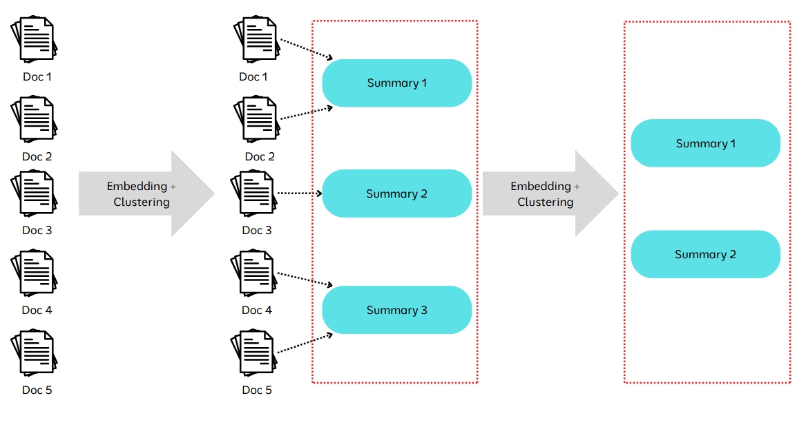

# Introduction

**What is Retrieval Augmented Generation (RAG)?**

At its core ,RAG is a technique that blends two powerful components: 

**1.Retrieval System**: Think of this as a librarian that fetches the most relevant documents or pieces of information from a vast knowledge base. 

**2.Generative Model:** This is the creative writer, crafting meaningful responses or content based on the retrieved information. Instead of relying solely on a generative model's internal knowledge ( which may be outdated or limited),RAG ensures the model has access to up-to-date, relevant data during inference. This is achieved by retrieving external information in real-time, making the responses more accurate and contextually rich.

- RAG is used when the data is vast, dynamic or frequently loaded.

**Limitations of Finetuning**

1. Expensive to Retrain for updates.
2. Required Substantial Data
3. Task specific model may not generalized well ( Less Versatile ) 

**Advantages of RAG**

1. Up-to-date knowledge
2. Reduced Hallucination
3. Cost Efficiency
4. Scalability

### RAG - Retrieval Augmented Generation

1. Query the Knowledge Base
    1. Gather the Required data from the Knowledge Base
2. Fuse Data
    1. User query and knowledge base is given to the LLM
3. Generate the Response
    1. Generate the Response with the help of query and retrieved data

**Usecases**

1. Legal Domain
2. Market Research
3. Healthcare
4. Customer Support

**Future**

- explosion of unstructured data and demand for accurate AI system will only increase
- Because, ability to integrate real time information